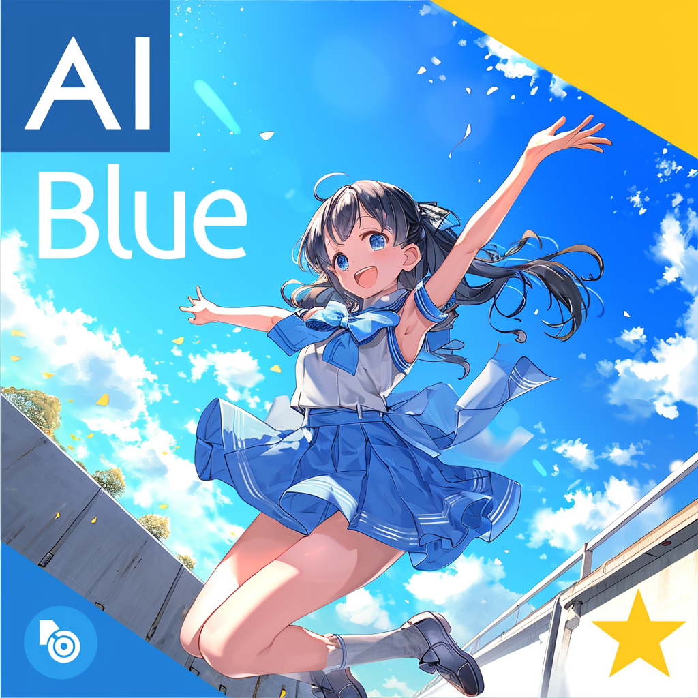

# AIBlue Ultra


## Project Overview

AIBlue Ultra is a cutting-edge, multi-headed AI integration platform designed to analyze and respond to complex scenarios with precision. By leveraging a combination of specialized AI models through advanced routing and weighting algorithms, AIBlue Ultra delivers nuanced and intelligent insights into a wide array of dynamic real-world problems. This platform stands at the forefront of technology, offering adaptive, informed, and contextually aware solutions.



## Getting Started

### Prerequisites

Ensure you have Python installed on your system. AIBlue Ultra is built to be simple and straightforward, requiring only four main files to function (with related html files in templates directory):

1. `requirements.txt` - Lists all the necessary Python packages.
2. `ai_blue_prototype.py` - The main Python script for the AIBlue Ultra model.
3. `session_manager.py` - The user session management engine.
4. `ai_app.py` - Web Interface for both AIBlue Ultra and configuration


### Installation

1. Clone the repository:
   ```console
   git clone https://github.com/yourusername/aiblue_ultra.git
   ```
2. Navigate to the AIBlue Ultra directory:
   ```console
   cd aiblue_ultra
   ```
3. Install the required packages:
   ```console
   pip install -r requirements.txt
   ```


### Running the Application

To run AIBlue Ultra, use the following command:

```console
nohup python session_manager.py &
```

```console
nohup python aiblue_ultra.py &
```

```console
nohup python ai_app.py &
```

Alternatively, you can use `screen` for session management, and start the user_management module.

```console
screen
python session_manager.py
```

And press `Ctrl-a, d` to exit that session. And start AIBlue Ultra module.

```console
screen
python aiblue_ultra.py
```
And press `Ctrl-a, d` to exit that session once again.

```console
screen
python ai_app.py
```
And press `Ctrl-a, d` to exit that session once again.

You can also use screen commmand `screen -ls` to monitor and `screen -r SCREEN-ID`return to specific screen session.

AIBlue Ultra listens on port `192.0.0.1:7860` and the database session listens to port `192.0.0.1:5001`. You can experiment with the live model at:

- Local: `http://192.0.0.1:7861/`
- Public IP: `http://34.29.172.222:7861/`
- Short URL: [bit.ly/AIBlueUltra](https://bit.ly/AIBlueUltra)

### Data Collection and Privacy

AIBlue Ultra is designed to continually improve and personalize the user experience. To achieve this, it collects and analyzes session information, including data from cookies and chat logs. This information helps us understand how users interact with AIBlue Ultra, allowing us to make enhancements and provide a more tailored experience.

**What We Collect**:
- **Cookies**: To understand user preferences and provide a personalized experience.
- **Chat Logs**: To analyze interactions and improve response accuracy and relevance.

**Your Privacy**:
Your privacy is important to us. All collected data is used solely for the purpose of enhancing AIBlue Ultra's performance and user experience. We are committed to maintaining transparency and control over your data.

**Prefer Not to Share?**:
If you prefer not to have your data collected, you have the option to use AIBlue Ultra in a more private setting:
- **Download and Compile**: You can download AIBlue Ultra and compile it on your own local system. This way, you can use the AI without sending data back to our servers. The database will be stored in `session.db`. You can access the database by using the command `sqlite3 sessions.db`. Within it, you can retrieve data using the command `SELECT * FROM sessions;`.

By using AIBlue Ultra, you agree to the data collection and use as described above. We appreciate your trust and are committed to using your information responsibly and improving your experience with AIBlue Ultra.


## Concept and Algorithm

AIBlue Ultra is a sophisticated chatbot powered by a multi-headed AI approach, designed by AI Tensibility of the Siam Intelligence Unit. This innovative structure allows different AI models to analyze input data concurrently, with each model focusing on its area of expertise. The outputs from these models are then routed through a central "router" model, which intelligently integrates these insights based on predefined weights and contextual understanding. This dynamic system ensures that AIBlue Ultra's responses are not only comprehensive but also reflect a deeper level of analysis and insight.

Enhanced by Retrieval-Augmented Generation (RAG), AIBlue Ultra can access and incorporate the most current information into discussions, ensuring its knowledge base is always up-to-date. It's not just about processing data; it's about understanding, learning, and adapting to provide the most accurate and relevant information possible.

### Key Features:

- **Multi-headed AI Structure:** AIBlue Ultra's architecture allows for efficient information processing and response generation, enabling it to tackle a wide array of topics and questions with depth and nuance.
- **Enhanced RAG (Retrieval-Augmented Generation):** This mechanism empowers AIBlue Ultra to seamlessly access and integrate up-to-date information, ensuring that conversations are informed by the latest data and developments.
- **Dynamic Weighting:** AIBlue Ultra adjusts the influence of each sub-model in real-time based on the context, ensuring that the most relevant expertise is always at the forefront.
- **Intelligent Routing:** The central router model analyzes and directs tasks to the most suitable AI model, optimizing the chatbot's understanding and response accuracy.
- **Robust Integration:** AIBlue Ultra synthesizes outputs from various AI models into a cohesive and coherent response, providing users with comprehensive answers.
- **Dynamic Learning:** Continuously learning from interactions, AIBlue Ultra refines its accuracy and effectiveness over time, adapting to new information and user feedback.
- **Conversational Adaptability:** Tailoring responses to individual communication styles, AIBlue Ultra ensures a personalized and engaging interaction experience.
- **Privacy and Security:** Adhering to strict security measures, AIBlue Ultra treats all conversations confidentially, respecting user privacy and data protection.

AAIBlue Ultra represents the cutting edge in chatbot technology, offering a conversational experience that's not just informative but also adaptive, engaging, and ever-evolving. Whether you're looking for detailed explanations, current event discussions, or just a friendly chat, AIBlue Ultra is equipped to provide a superior interaction experience.

## Contributions

We welcome contributions and suggestions! Please read `CONTRIBUTING.md` for details on our code of conduct and the process for submitting pull requests.

## License

This project is licensed under the Apache License 2.0 - see the `LICENSE` file for details.

## Acknowledgments

- Thanks to all the contributors who have invested their time into making AIBlue Ultra a valuable tool.
- Special thanks to the open-source community for providing the tools and libraries that make projects like this possible.
